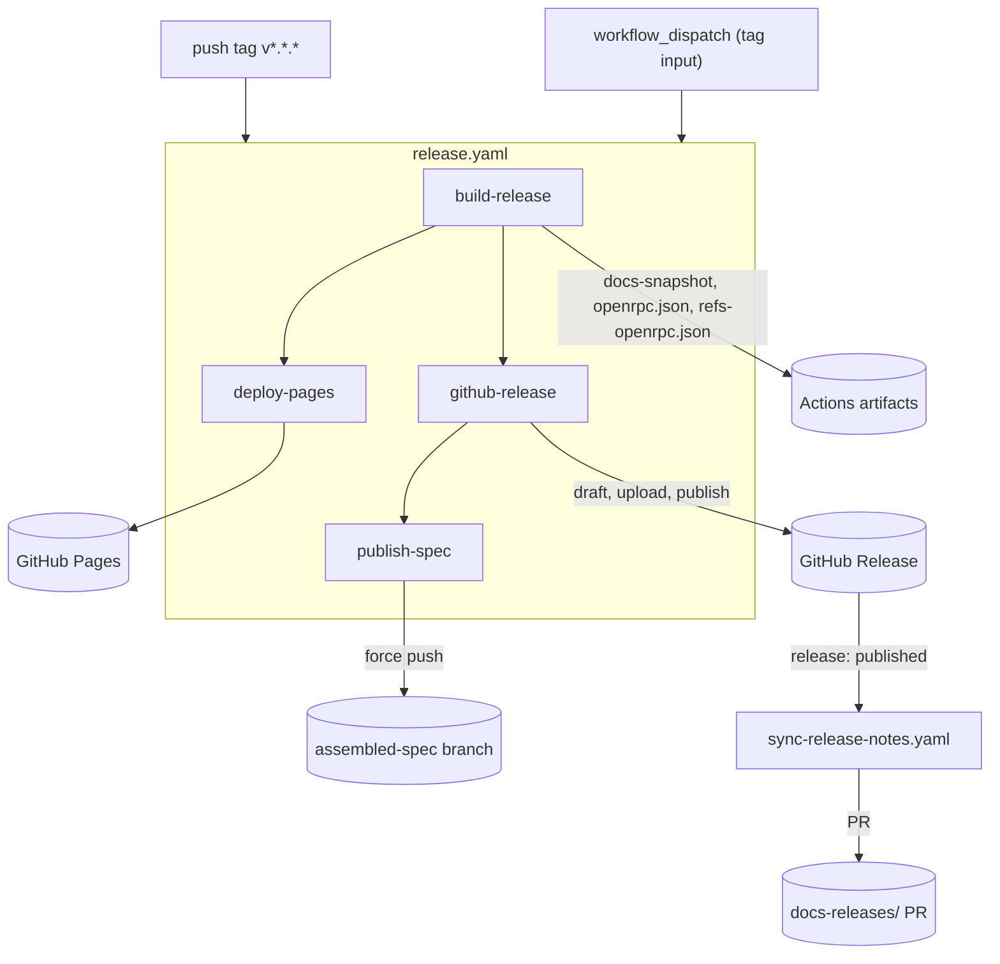
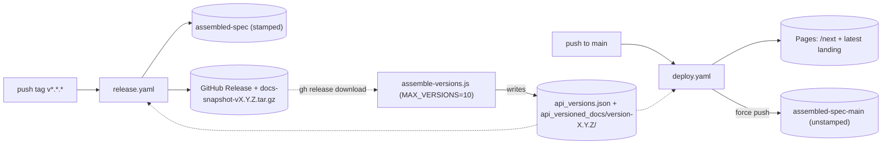

# GitHub Actions workflows

This directory drives three kinds of automation: the **release pipeline** (tag → build → Pages → GitHub Release → stamped spec branch), **continuous deploy from `main`** (rolling docs site and unstamped spec branch), and **PR gating** (spec tests, docs smoke-build, spellcheck).

## Workflows

- [release.yaml](release.yaml) — `push tag v*.*.*` or `workflow_dispatch`. Full release: build, version snapshot, Pages deploy, GitHub Release, stamped spec branch.
- [sync-release-notes.yaml](sync-release-notes.yaml) — `release: published|edited` or `workflow_dispatch`. Mirrors release notes into `docs-releases/` via PR.
- [publish-spec.yaml](publish-spec.yaml) — `workflow_dispatch` only. Manual recovery: re-push `assembled-spec` from existing release assets.
- [deploy.yaml](deploy.yaml) — `push: main` or dispatch. Rolling Pages deploy + pushes `assembled-spec-main` (unstamped).
- [test.yaml](test.yaml) — push/PR. `make build`, speccheck, test filling, lint.
- [test-deploy.yaml](test-deploy.yaml) — PR to `main`. Smoke-builds the site with and without a synthesized version snapshot.
- [spellcheck.yaml](spellcheck.yaml) — push/PR. `rojopolis/spellcheck-github-actions`.

## Release happy path



The `github-release` job deliberately uses a **draft → upload → publish** sequence. Before uploading assets it forces the release back to draft (`gh release edit … --draft=true`) so a re-run cannot publish prematurely. Only after `openrpc.json`, `refs-openrpc.json`, and `docs-snapshot-<tag>.tar.gz` are attached does it set `--draft=false`. That avoids firing `release: published` while assets are still missing, which would trigger [sync-release-notes.yaml](sync-release-notes.yaml) against an incomplete release.

## Branch and version lifecycle

Versioned API docs on Pages are assembled from past release snapshots plus the current build. [scripts/assemble-versions.js](../../scripts/assemble-versions.js) downloads `docs-snapshot-*.tar.gz` from published GitHub Releases (up to 10 versions) and writes `api_versions.json` plus `api_versioned_docs/version-X.Y.Z/`.



## Maintainer runbook

### Cut a release

Tag `vX.Y.Z` on `main` and push the tag. [release.yaml](release.yaml) runs automatically; no manual steps are required for Pages, the GitHub Release, or `assembled-spec`.

### Automated Release Notes PR

NOTE: The release will then trigger a release notes PR. Because we publish the draft to NEXT, the actual commit sha of the repo doesn't change on tag push. This then can sometimes
not invalidate the cache. The subsequent automated PR that follows, forces the version and the release notes to invalidate the github pages CDN, when merged. This will guarantee that
the latest release invalidates the github pages cache and deploys.

### Re-run a release

```bash
gh workflow run release.yaml -f tag=vX.Y.Z
```

The workflow is idempotent: it re-drafts, re-uploads, and re-publishes. During `assemble-versions.js`, the pending tag is not downloaded from GitHub—the local snapshot from `docusaurus docs:version:api` is used instead (see [assemble-versions.js lines 110–121](../../scripts/assemble-versions.js)).

### Recover just `assembled-spec`

Use [publish-spec.yaml](publish-spec.yaml) with the tag input. It downloads `openrpc.json` and `refs-openrpc.json` from the existing GitHub Release and force-pushes `assembled-spec`. If those assets are missing, re-run [release.yaml](release.yaml) instead—do not use this recovery workflow.

### Recover release notes PR

```bash
gh workflow run sync-release-notes.yaml -f tag=vX.Y.Z
```

Reopens or updates the `release-notes/<slug>` PR that mirrors the GitHub Release into `docs-releases/`.

### Version dropdown missing a release

Confirm `docs-snapshot-vX.Y.Z.tar.gz` exists on the GitHub Release for that tag. [assemble-versions.js](../../scripts/assemble-versions.js) silently skips releases without that asset.

## Contracts between jobs

- `build-release` uploads two artifacts: `openrpc-spec` (`openrpc.json` + `refs-openrpc.json`) and `docs-snapshot` (the `.tar.gz`). Both `github-release` and `publish-spec` download `openrpc-spec`; `github-release` also downloads `docs-snapshot`.
- `concurrency.group: "pages"` is shared with [deploy.yaml](deploy.yaml). [release.yaml](release.yaml) sets `cancel-in-progress: true` so a release pre-empts an in-flight main deploy.
- `assembled-spec` is **stamped** (version baked in via `npm run spec:set-version`); `assembled-spec-main` is **unstamped** (rolling head of `main`). Consumers pin to one or the other deliberately.
- [sync-release-notes.yaml](sync-release-notes.yaml) keys its PR branch off `steps.sync.outputs.slug`—repeated edits to the same release update the same PR rather than spawning new ones.
- `release: published` fires the sync-release-notes workflow; therefore `github-release` uploads assets **while drafted** and only flips to published once.
