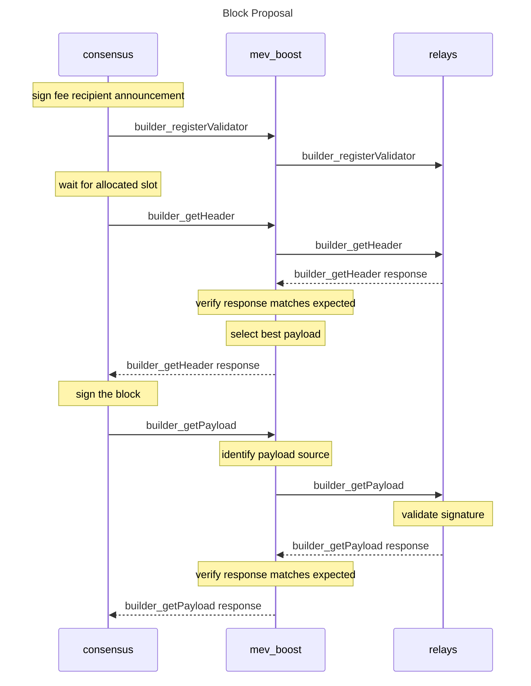

# Builder API

This document specifies the Builder API methods that the Consensus Layer uses to interact with external block builders.



## Structures

### `ExecutionPayloadV1`

Mirror of [`ExecutionPayloadV1`][execution-payload].

### `ExecutionPayloadHeaderV1`
Equivalent to `ExecutionPayloadV1`, except `transactions` is replaced with `transactionsRoot`.
- `parentHash`: `DATA`, 32 Bytes
- `feeRecipient`:  `DATA`, 20 Bytes
- `stateRoot`: `DATA`, 32 Bytes
- `receiptsRoot`: `DATA`, 32 Bytes
- `logsBloom`: `DATA`, 256 Bytes
- `prevRandao`: `DATA`, 32 Bytes
- `blockNumber`: `QUANTITY`, 64 Bits
- `gasLimit`: `QUANTITY`, 64 Bits
- `gasUsed`: `QUANTITY`, 64 Bits
- `timestamp`: `QUANTITY`, 64 Bits
- `extraData`: `DATA`, 0 to 32 Bytes
- `baseFeePerGas`: `QUANTITY`, 256 Bits
- `blockHash`: `DATA`, 32 Bytes
- `transactionsRoot`: `DATA`, 32 Bytes

### `BlindBeaconBlockV1`
- `slot`: `QUANTITY`, 64 Bits
- `proposerIndex`: `QUANTITY`, 64 Bits
- `parentRoot`: `DATA`, 32 Bytes
- `stateRoot`: `DATA`, 32 Bytes
- `body`: `object`, [`BlindBeaconBlockBodyV1`](#blindbeaconblockbodyv1)

### `BlindBeaconBlockBodyV1`
- `randaoReveal`: `DATA`, 96 Bytes
- `eth1Data`: `object`, [`Eth1DataV1`](#eth1datav1)
- `graffiti`: `DATA`, 32 Bytes
- `proposerSlashings`: `Array`, [`ProposerSlashingV1`](#proposerslashingv1)
- `attesterSlashings`: `Array`, [`AttesterSlashingV1`](#attesterslashingv1)
- `attestations`: `Array`, [`AttestationV1`](#attestationv1)
- `deposits`: `Array`, [`DespositV1`](#depositv1)
- `voluntaryExits`: `Array`, [`SignedVoluntaryExitV1`](#signedvoluntaryexitv1)
- `syncAggregate`: `object`, [`SyncAggregateV1`](#syncaggregatev1)
- `executionPayload`: `object`, [`ExecutionPayloadHeaderV1`](#executionpayloadheaderv1)

### `Eth1DataV1`
- `depositRoot`: `DATA`, 32 Bytes
- `depositCount`: `QUANTITY`, 64 Bits
- `blockHash`: `DATA`, 32 Bytes

### `ProposerSlashingV1`
- `signedHeader1`: `object`, [`SignedBeaconBlockHeaderV1`](#signedbeaconblockheaderv1)
- `signedHeader2`: `object`, [`SignedBeaconBlockHeaderV1`](#signedbeaconblockheaderv1)

### `BeaconBlockHeaderV1`
- `slot`: `QUANTITY`, 64 Bits
- `proposerIndex`: `QUANTITY`, 64 Bits
- `parentRoot`: `DATA`, 32 Bytes
- `stateRoot`: `DATA`, 32 Bytes
- `bodyRoot`: `DATA`, 32 Bytes

### `AttesterSlashingV1`
- `attestation1`: `object`, [`IndexedAttestationV1`](#indexedattestationv1)
- `attestation2`: `object`, [`IndexedAttestationV1`](#indexedattestationv1)

### `IndexedAttestationV1`
- `attestingIndices`: `Array`, `QUANTITY`, 64 Bits
- `data`: `object`, [`AttestationDataV1`](#attestationdatav1)
- `signature`: `DATA`, 96 Bytes

### `AttestationDataV1`
- `slot`: `QUANTITY`, 64 Bits
- `index`: `QUANTITY`, 64 Bits
- `beaconBlockRoot`, `DATA`, 32 Bytes
- `source`: `object`, [`CheckpointV1`](#checkpointv1)
- `target`: `object`, [`CheckpointV1`](#checkpointv1)

### `CheckpointV1`
- `epoch`: `QUANTITY`, 64 Bits
- `root`: `DATA`, 32 Bytes

### `AttestationV1`
- `aggregationBits`: `DATA`, 0 to 256 Bytes
- `data`: `object`, [`AttestationDataV1`](#attestationdatav1)
- `signature`: `DATA`, 96 Bytes

### `DepositV1`
- `proof`: `Array`, 32 Bytes
- `data`: `object`, [`DepositDataV1`](#depositdatav1)

### `DepositDataV1`
- `pubkey`: `DATA`, 48 Bytes
- `withdrawalCredentials`: `DATA`, 32 Bytes
- `amount`: `QUANTITY`, 64 Bits
- `signature`: `DATA`, 96 Bytes

### `VoluntaryExitV1`
- `epoch`: `QUANTITY`, 64 Bits
- `ValidatorIndex`: `QUANTITY`, 64 Bits

### `SyncAggregateV1`
- `syncCommitteeBits`: `DATA`, 64 Bytes
- `syncCommitteeSignature`: `DATA`, 96 Bytes

#### Signed Containers

### `SignedBeaconBlockHeaderV1`
- `message`: `object`, [`BeaconBlockHeader`](#beaconblockheaderv1)
- `signature`: `DATA`, 96 Bytes

### `SignedVoluntaryExitV1`
- `message`: `object`, [`VoluntaryExitV1`](#voluntaryexitv1)
- `signature`: `DATA`, 96 Bytes

#### SSZ Objects

Consider the following definitions supplementary to the definitions in [`consensus-specs`][consensus-specs].

##### `ValidatorRegistrationV1`

```python
class ValidatorRegistrationV1(Container):
    feeRecipient: Bytes20
    timestamp: uint64
    pubkey: BLSPubkey
```

##### `BuilderReceiptV1`

```python
class BuilderReceiptV1(Container):
    payload: ExecutionPayloadHeader
    value: uint256
    pubkey: BLSPubkey
```

###### `BlindBeaconBlock`

```python
class BlindBeaconBlock(Container):
    slot: Slot
    proposer_index: ValidatorIndex
    parent_root: Root
    state_root: Root
    body: BlindBeaconBlockBody
```

###### `BlindBeaconBlockBody`

```python
class BlindBeaconBlockBody(Container):
    randao_reveal: BLSSignature
    eth1_data: Eth1Data
    graffiti: Bytes32
    proposer_slashings: List[ProposerSlashing, MAX_PROPOSER_SLASHINGS]
    attester_slashings: List[AttesterSlashing, MAX_ATTESTER_SLASHINGS]
    attestations: List[Attestation, MAX_ATTESTATIONS]
    deposits: List[Deposit, MAX_DEPOSITS]
    voluntary_exits: List[SignedVoluntaryExit, MAX_VOLUNTARY_EXITS]
    sync_aggregate: SyncAggregate
    execution_payload: ExecutionPayloadHeader
```

## Errors

The list of error codes introduced by this specification can be found below.

| Code | Message | Meaning |
| - | - | - |
| -32000 | Server error | Generic client error while processing request. |
| -32001 | Unknown hash | No block with the provided hash is known. |
| -32002 | Unknown validator | Unknown validator. |
| -32003 | Unknown fee recipient | No known mapping between validator and fee recipient. |
| -32004 | Unknown block | Block does not match the provided header. |
| -32005 | Invalid signature | Provided signature is invalid. |
| -32006 | Invalid timestamp | Provided timestamp was invalid. |
| -32600 | Invalid request | The JSON sent is not a valid Request object. |
| -32601 | Method not found | The method does not exist / is not available. |
| -32602 | Invalid params | Invalid method parameter(s). |
| -32603 | Internal error | Internal JSON-RPC error. |
| -32700 | Parse error | Invalid JSON was received by the server. |

Each error returns a `null` `data` value, except `-32000` which returns the `data` object with a `err` member that explains the error encountered.

For example:

```
$ curl https://localhost:8550 \
    -X POST \
    -H "Content-Type: application/json" \
    -d '{"jsonrpc":"2.0","method":"engine_getPayloadV1","params": ["0x1"],"id":1}'
{
  "jsonrpc": "2.0",
  "id": 1,
  "error": {
    "code": -32000,
    "message": "Server error",
    "data": {
        "err": "Database corrupted"
    }
  }
}
```

## Routines

### Signing

All signature operations should follow the [standard BLS operations][bls] interface defined in `consensus-specs`.

There are two types of data to sign over in the Builder API:
* In-protocol messages, e.g. [`BlindBeaconBlock`](#blindbeaconblock), which should compute the signing root using [`compute_signing_root`][compute-signing-root] and use the domain specified for beacon block proposals.
* Builder API messages, e.g. [`builder_registerValidatorV1`](#builder_registerValidatorV1) and the response to [`builder_getHeader`](#response-2), which should compute the signing root using [`compute_signing_root`][compute-signing-root] and the domain `DomainType('0xXXXXXXXX')` (TODO: get a proper domain).

As `compute_signing_root` takes `SSZObject` as input, client software should convert in-protocol messages to their SSZ representation to compute the signing root and Builder API messages to the SSZ representations defined [above](#sszobjects).

## Methods

### `builder_status`

#### Request

- method: `builder_status`
- params: `null`

#### Response

- result: `enum`, `"OK" | null`
- error: code and message set in case the builder is not operating normally.

#### Specification

1. Builder software **MUST** return `-32000: Server error` if it is unable to respond to requests. `err` **SHOULD** be set explaining the issue and `result` **MUST** be `null`.

### `builder_registerValidatorV1`

#### Request

- method: `builder_registerValidatorV1`
- params:
  1. `message`: `object`
      1. `feeRecipient`: `DATA`, 20 Bytes - Address of account which should receive fees.
      2. `timestamp`: `QUANTITY`, uint64 - Unix timestamp of announcement.
      3. `pubkey`: `DATA`, 48 Bytes - BLS public key of validator.
  3. `signature`: `DATA`, 96 Bytes - BLS signature over [`ValidatorRegistrationV1`](#validatorregistrationv1).

#### Response

- result: `enum`, `"OK" | null`
- error: code and message set in case an exception happens while registering the validator.

#### Specification
1. Builder software **MUST** verify `signature` is valid under `pubkey`, otherwise return error `-32005: Invalid Signature`.
2. Builder software **MUST** respond to requests where `timestamp` is less than or equal to the latest announcement from the validator or more than 1 hour in the future with error `-32007: Invalid timestamp`.
3. Builder software **MUST** store `feeRecipient` in a map keyed by `pubkey`.
4. Builder software **MUST** return `result` as `"OK"` if the request succeeds, `null` otherwise.

### `builder_getHeaderV1`

#### Request

- method: `builder_getHeaderV1`
- params:
  1. `slot`: `QUANTITY`, 64 Bits - Slot number of the block proposal.
  2. `pubkey`: `QUANTITY`, 48 Bytes - BLS public key of validator.
  3. `hash`: `DATA`, 32 Bytes - Hash of execution layer block the proposer will use as the proposal's parent.

#### Response

- result: `object`
    - `message`: `object`
        - `header`: [`ExecutionPayloadHeaderV1`](#executionpayloadheaderv1).
        - `value`: `DATA`, 32 Bytes - Payment in wei that will be paid to the `feeRecipient` account.
        - `pubkey`: `DATA`, 48 Bytes - BLS public key associated with the builder.
    - `signature`: `DATA`, 96 Bytes - BLS signature over [`BuilderReceiptV1`](#builderreceiptv1).
- error: code and message set in case an exception happens while getting the header.

#### Specification
1. Builder software **SHOULD** respond immediately with the `header` that increases the `feeRecipient`'s balance by the most.
2. Builder software **MUST** return `-32001: Unknown hash` if the block identified by `hash` is not known.
3. Builder software **MUST** return `-32002: Unknown validator` if `pubkey` does not map to the validator that is expected to propose at `slot`.
4. Builder software **MUST** return `-32003: Unknown fee recipient` if the builder does not have a `feeRecipient` mapped to the validator.
5. Builder software **MAY** set the `feeRecipient` for the block to a different address than the address mapped to the validator so long as a payment equal to `value` is made to `feeRecipient`.

### `builder_getPayloadV1`

#### Request

- method: `builder_getPayloadV1`
- params:
  1. `message`: [`BlindBeaconBlock`](#blindbeaconblockv1).
  2. `signature`: `DATA`, 96 Bytes - BLS signature over [`BlindBeaconBlock`](#blindbeaconblockv1).

#### Response

- result: [`ExecutionPayloadV1`](#executionpayloadv1).
- error: code and message set in case an exception happens while proposing the payload.

#### Specification
1. Builder software **MUST** verify that the beacon block's exeuction payload is a matching [`ExecutionPayloadHeaderV1`](#executionpayloadheaderv1) provided from [`builder_getHeaderV1`](#buildergetheaderv1), otherwise the return `-32004: Unknown block`.
2. Builder software **MUST** verify that `signature` is a BLS signature over `block` using [`verify_block_signature`][verify-block-signature] from the validator that is expected to propose in the slot. If the signature is determined to be invalid or from a different validator than expected, the builder **MUST** return `-32005: Invalid signature`.

[consensus-specs]: https://github.com/ethereum/consensus-specs
[bls]: https://github.com/ethereum/consensus-specs/blob/dev/specs/phase0/beacon-chain.md#bls-signatures
[compute-signing-root]: https://github.com/ethereum/consensus-specs/blob/dev/specs/phase0/beacon-chain.md#compute_signing_root
[bytes20]: https://github.com/ethereum/consensus-specs/blob/dev/ssz/simple-serialize.md#aliases
[uint256]: https://github.com/ethereum/consensus-specs/blob/dev/ssz/simple-serialize.md#basic-types
[execution-payload-header]: https://github.com/ethereum/consensus-specs/blob/dev/specs/bellatrix/beacon-chain.md#executionpayloadheader
[execution-payload]: https://github.com/ethereum/execution-apis/blob/main/src/engine/specification.md#executionpayloadv1
[hash-tree-root]: https://github.com/ethereum/consensus-specs/blob/dev/ssz/simple-serialize.md#merkleization
[beacon-block]: https://github.com/ethereum/consensus-specs/blob/dev/specs/phase0/beacon-chain.md#beaconblock
[verify-block-signature]: https://github.com/ethereum/consensus-specs/blob/dev/specs/phase0/beacon-chain.md#beacon-chain-state-transition-function
